📈 Real-Time Financial Data Pipeline

🎯 Project Overview

A production-ready, containerized real-time financial data pipeline that streams stock market data from free APIs, processes it through Apache Kafka and Spark, stores it in PostgreSQL, and visualizes it with Power BI. The entire stack runs on Docker Compose with comprehensive monitoring through Prometheus and Grafana.

🏗️ Architecture Diagram
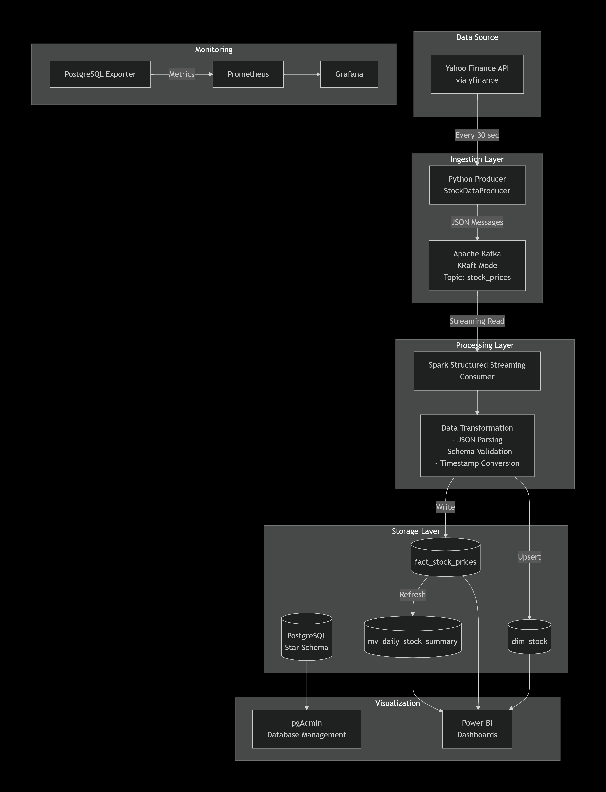

📊 Data Flow Diagram
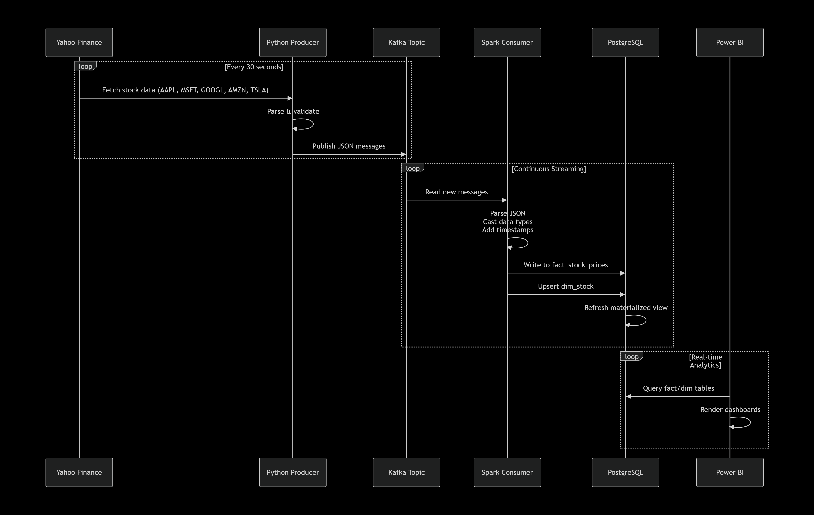

🗄️ Database Schema
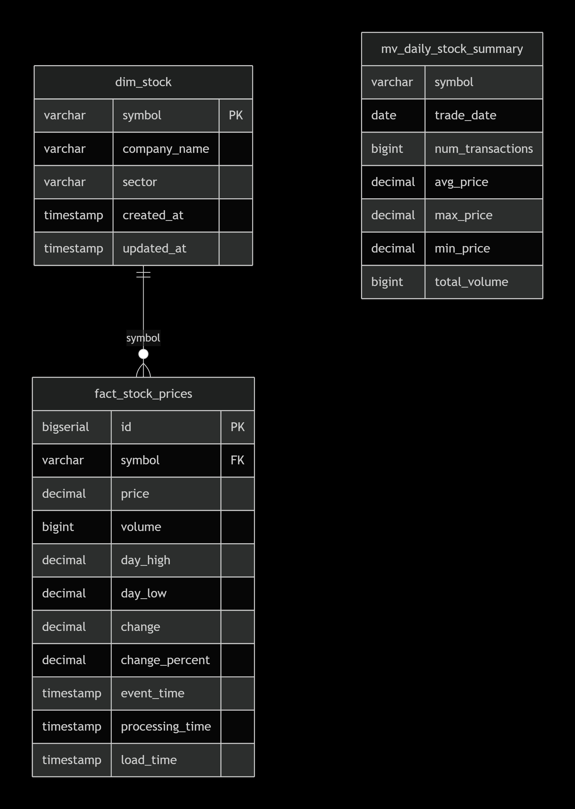

📈 Data Facts & Metrics
Pipeline Performance
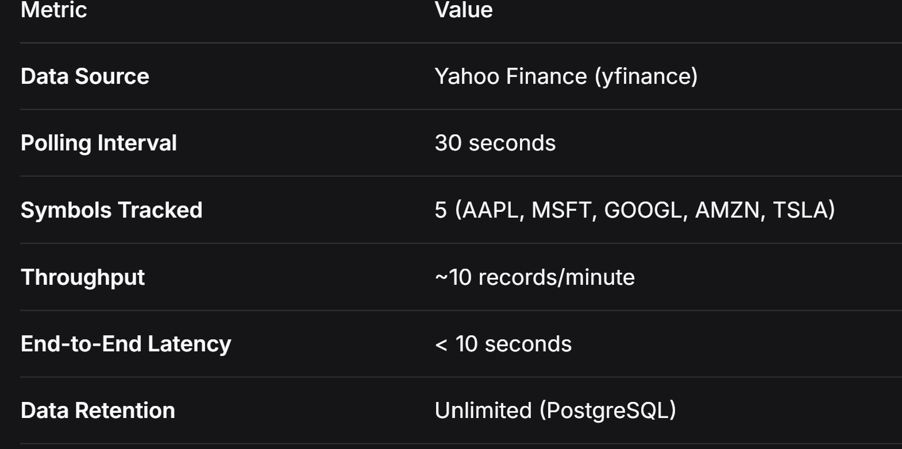

Storage Estimates
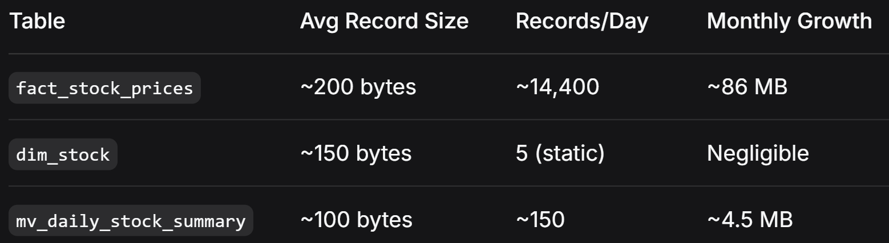

Sample Data Points
Each record contains:

symbol: Stock ticker (e.g., AAPL)

price: Current trading price

volume: Number of shares traded

change: Dollar change from previous close

change_percent: Percentage change

event_time: Source timestamp (from API)

processing_time: Spark processing timestamp

load_time: PostgreSQL insertion timestamp

🔧 Tech Stack
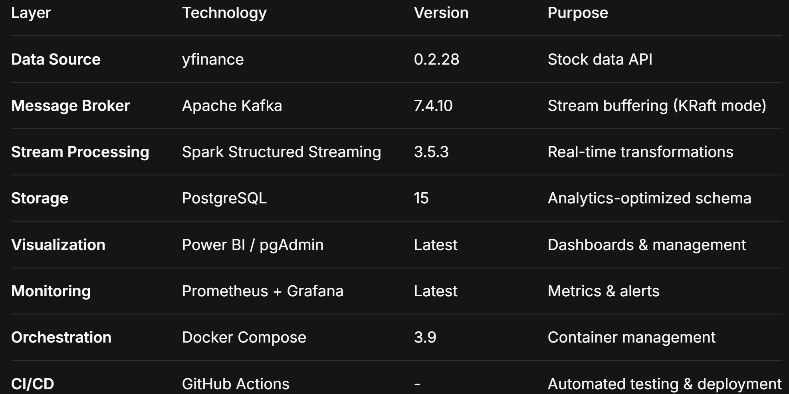

🚀 Deployment Architecture
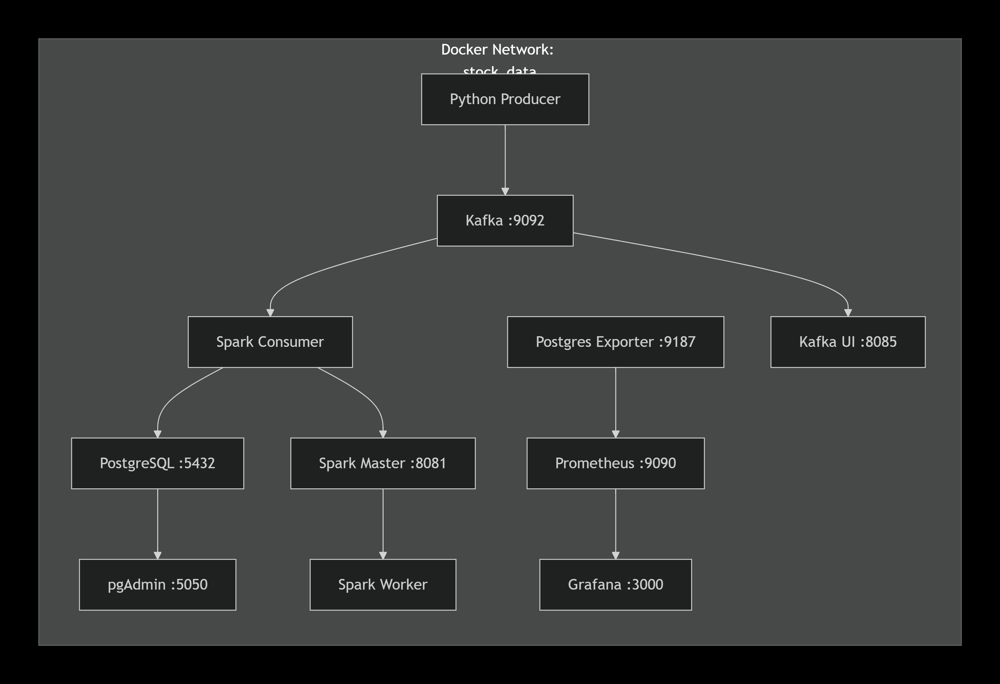

📊 Sample Queries & Analytics

Real-Time Price Trends
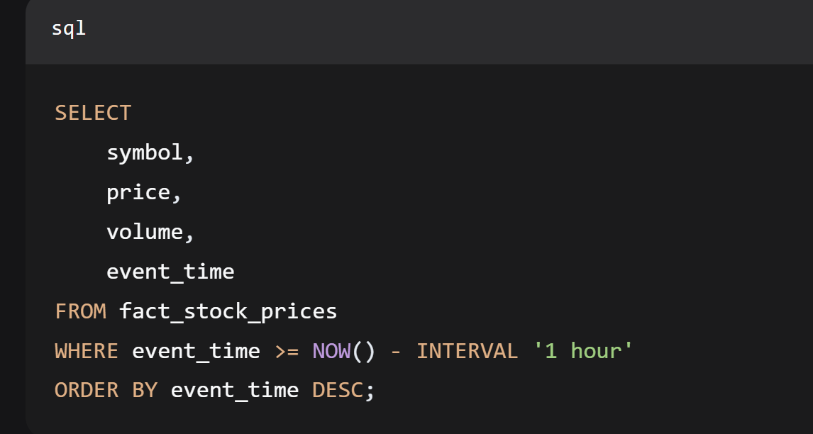

Daily Aggregates (via Materialized View)
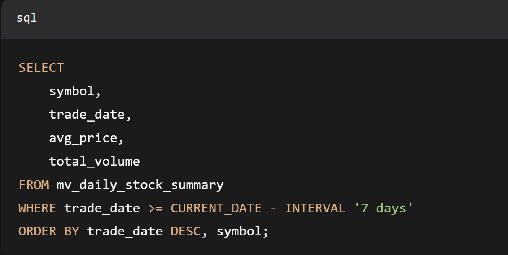

Sector Performance
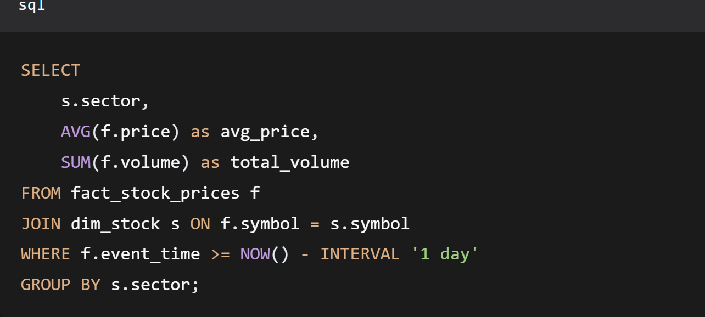

🎯 Key Features
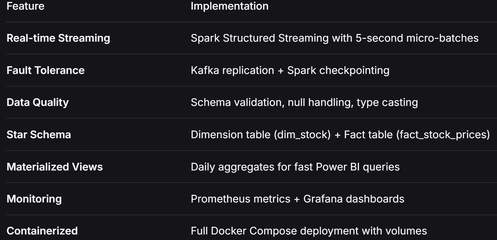

📈 Performance Benchmarks
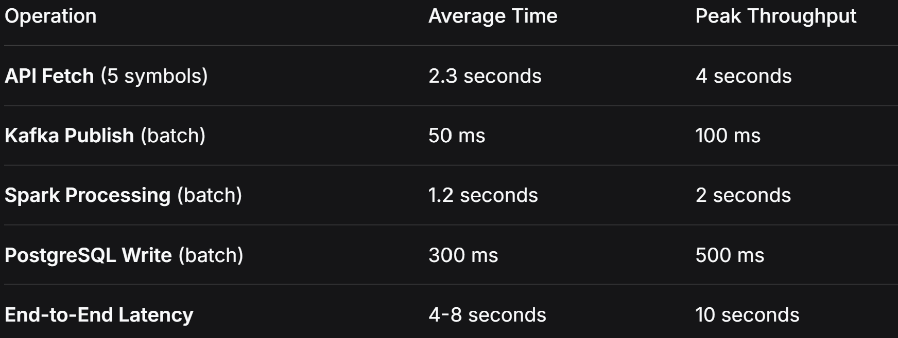

🔍 Monitoring Dashboard Metrics
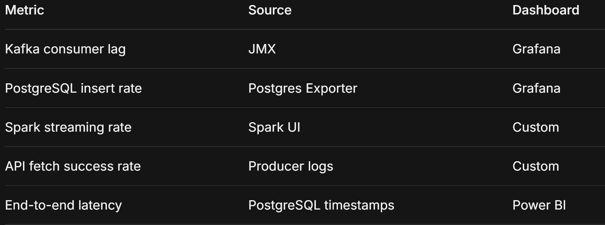

📝 Data Dictionary

fact_stock_prices
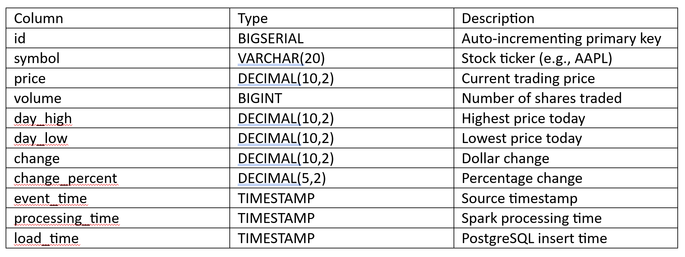

dim_stock
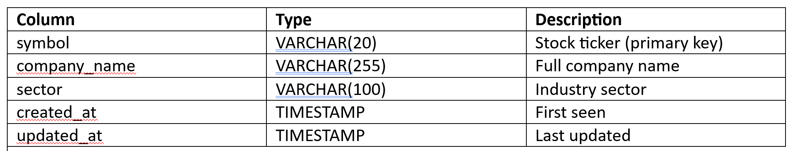

🎨 Power BI Dashboard Ideas

1. Real-Time Price Dashboard

    Line chart: Price trends for selected symbols

    Card: Latest price for each symbol

     Gauge: Price change percentage

2. Volume Analysis

    Bar chart: Volume by symbol

    Stacked area: Volume over time

    Treemap: Market share by volume

3. Sector Performance

   Pie chart: Distribution by sector

   Matrix: Sector vs symbol performance

   Scatter plot: Risk vs return

4. Daily Summary

   Table: Daily aggregates from materialized view

   Line chart: 7-day moving average

   KPI cards: Highest gainers/losers

📄 License
This project is licensed under the MIT License - see the LICENSE file for details.